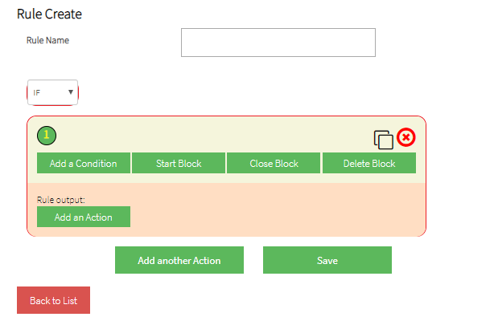
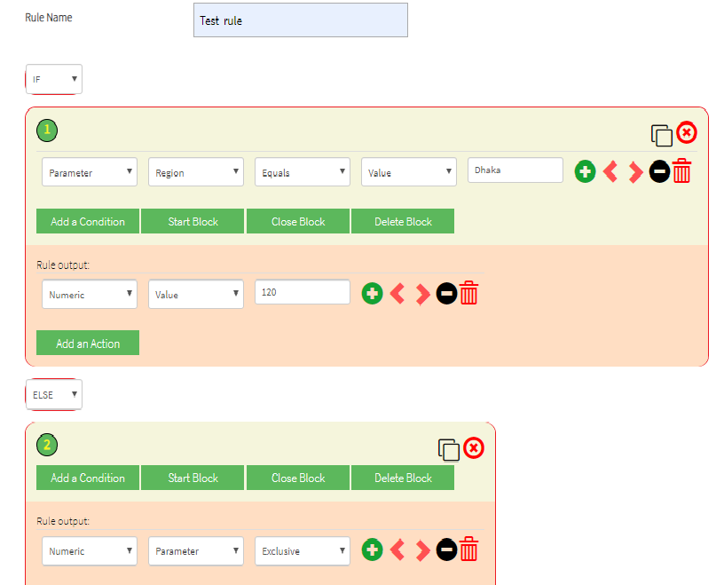
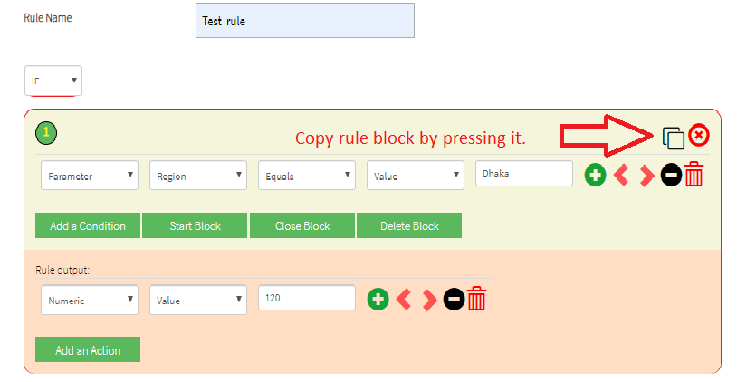
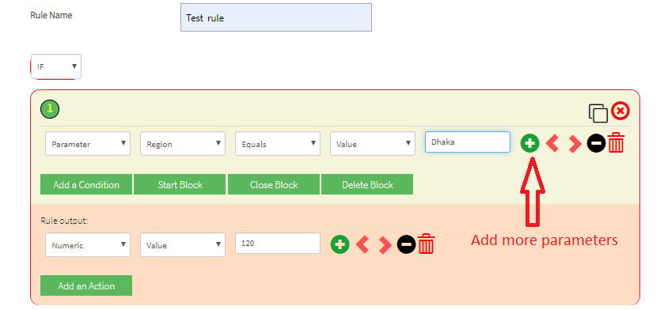

<h1> Guidelines to create rule-</h1>
1. Run the application and user will see the following screen-

 
2. User may select the parameters and values as follows-

3.A rule block can be copied as follows-

4.Extra rule parameters can be added by selecting last control

